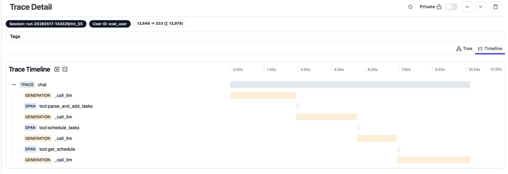
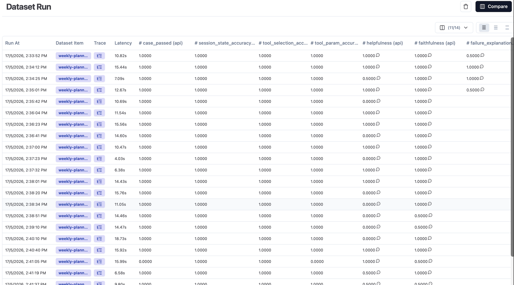
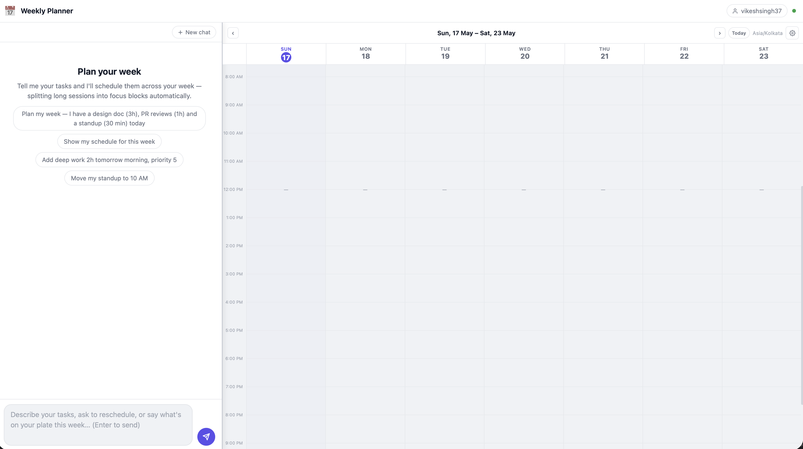
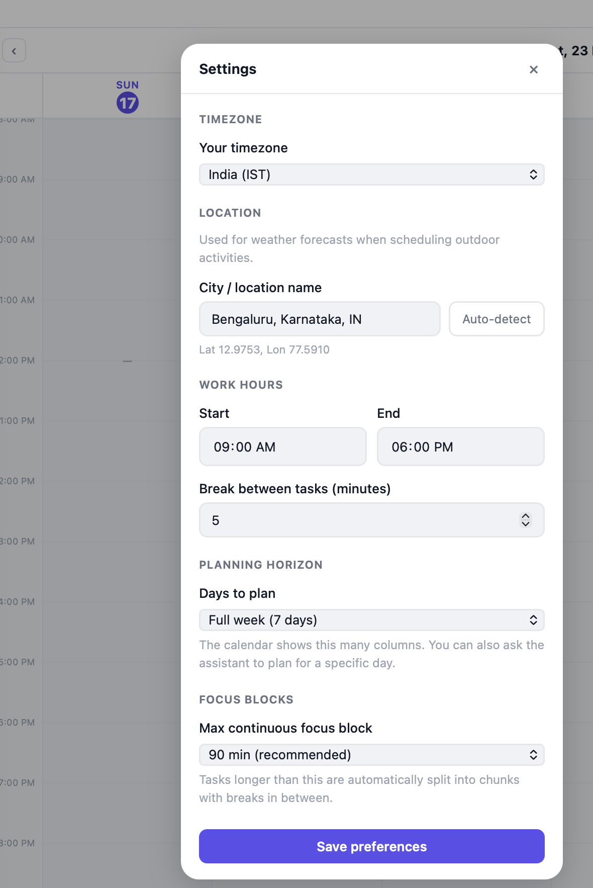
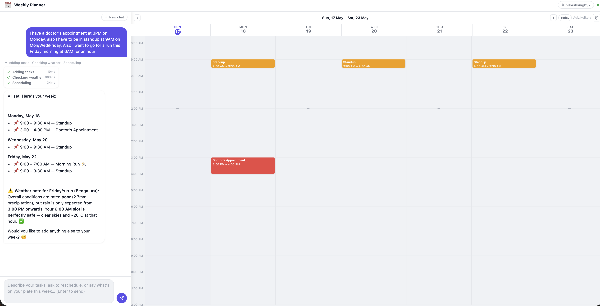
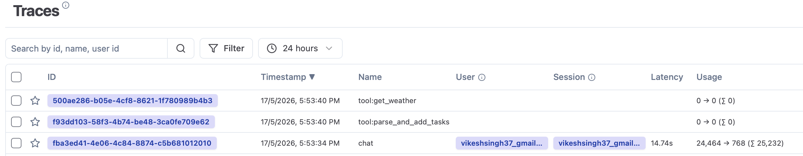

# Weekly Planner Agent

## What Was Built and Why

A **conversational weekly planner** was chosen as the problem. The task is a good fit for a reliability-first agent: it has concrete, verifiable outputs (a schedule), multiple naturally composable tools, and real failure modes worth handling (impossible deadlines, ambiguous durations, conflicts). It is also immediately useful as a day-to-day tool.

The agent takes natural language and produces a scheduled week. You say "I have a 3-hour design doc due at 2 PM, PR reviews for an hour, and standup at 9:30" and get back a time-blocked schedule. You can move tasks, remove them, ask about the week ahead, and get weather warnings for outdoor activities. Session state — tasks, preferences, conversation history — persists across the full conversation.

**Scope:** planning is limited to a **7-day rolling window from today** — by design. The goal was a tool for the current and near-future week, not a long-range calendar. Anything beyond 7 days is rejected with a clear error. Long-term persistence across separate sessions (e.g. "what did I plan last Monday?") is also out of scope; each session starts fresh.

**What was not built, and why:**

| Skipped | Reason |
|---------|--------|
| Google / Outlook calendar integration | OAuth-per-user is an infra problem, not an agent problem. Adds complexity that would dominate the 2-day scope. |
| Long-term memory across weeks | Single-session planner; the context window is the memory. No vector DB, no embeddings — the complexity is not justified for < 50 tasks. |
| Integer Linear Programming (ILP) constraint solver | EDF is provably optimal for the single-machine case. ILP adds exponential complexity with no practical gain here. |
| Per-task focus block overrides | All tasks share one `max_chunk_minutes` setting. Good enough for MVP; uniform is simpler to reason about. |
| Token revocation on sign-out | JWTs are stateless. Sign-out is client-side only. A Redis blocklist is the fix — low effort, just not in scope. |
| Password reset / email verification | No email service integrated. Would add infra noise without demonstrating anything interesting. |

---

## Architecture

### System overview

```
                             User
                              │
                 ┌────────────┴────────────┐
                 │                         │
        Browser / Web UI               CLI  cli.py
        chat · calendar · settings
                 │
        ┌────────┴──────────┐
        │ WebSocket /ws     │ REST  /auth/*  /api/schedule
        │ streaming events  │       /api/preferences  /api/location
        └────────┬──────────┘
                 │
        ┌────────▼──────────────────────────────┐
        │         FastAPI   server.py            │
        │         JWT Auth  impl/auth.py         │
        │         bcrypt  ·  data/users.json     │
        └────────┬──────────────────────────────-┘
                 │
        ┌────────▼──────────────────────────────────────────┐
        │              Agent   agent/agent.py                │
        │                                                    │
        │   ┌──────────────────────────────────────────┐    │
        │   │            Agentic Loop                  │    │
        │   │   1. call LLM with full message history  │    │
        │   │   2. receive tool_use blocks             │    │
        │   │   3. run tools in parallel               │    │
        │   │   4. feed results back → repeat          │    │
        │   │   5. stop on end_turn or 10-iter cap     │    │
        │   └───────────┬────────────────┬─────────────┘    │
        │               │                │                   │
        │    ┌──────────▼──────┐  ┌──────▼────────────────┐ │
        │    │  Anthropic API  │  │  ThreadPoolExecutor   │ │
        │    │ claude-sonnet   │  │  parallel tool calls  │ │
        │    │   -4-6          │  └──────────┬────────────┘ │
        │    │ extended        │             │               │
        │    │ thinking        │             │               │
        │    └─────────────────┘             │               │
        │                                    │ @observe      │
        │                               ┌────▼────┐          │
        │                               │Langfuse │          │
        │                               │:3000    │          │
        │                               │ · generation span  │
        │                               │   (tokens, model)  │
        │                               │ · tool spans       │
        │                               │   (inputs/outputs) │
        │                               │ · dataset evals    │
        │                               └─────────┘          │
        └────────────────────┬───────────────────────────────┘
                             │  7 tool calls
        ┌────────────────────▼──────────────────────────────┐
        │              Tools   impl/tools.py                 │
        │                                                    │
        │  parse_and_add_tasks   schedule_tasks   move_task  │
        │  remove_task   get_schedule   update_preferences   │
        │  get_weather                                       │
        └──────────┬────────────────┬──────────────┬────────┘
                   │                │              │
        ┌──────────▼──────┐  ┌──────▼──────┐  ┌───▼──────────┐
        │  EDF Scheduler  │  │  PostgreSQL │  │  Open-Meteo  │
        │ impl/scheduler  │  │  planner_   │  │  weather     │
        │ O(n log n)      │  │  sessions   │  │  forecast +  │
        │ focus block     │  │  JSONB      │  │  geocoding   │
        │ splitting       │  │  (shared    │  │  (no API key)│
        └─────────────────┘  │  with LF)   │  └──────────────┘
                             └──────┬──────┘
                                    │ fallback if DATABASE_URL unset
                             ┌──────▼──────┐
                             │  JSON files │
                             │  sessions/  │
                             └─────────────┘
```

---

### Framework: plain Python, not LangGraph

The agentic loop is ~50 lines in `agent/agent.py`. It calls the Anthropic API, runs all returned tool calls in parallel via `ThreadPoolExecutor`, feeds results back, and repeats until `end_turn` or a 10-iteration safety cap.

| | LangGraph | Plain Python |
|---|---|---|
| Debugging | Requires understanding graph state machine | Linear call stack, trivial to trace |
| Reliability | Extra abstraction between tool call and result | Direct function calls, no intermediaries |
| Testability | Graph nodes harder to isolate | Each tool is a pure `(inputs, session) → dict` — fully unit-testable |
| Dependencies | Large; opinionated about state shape | `anthropic` + `python-dotenv` only |
| Scale overhead | Graph serialisation, node checkpointing | Stateless HTTP handler + Postgres session |

The goal was a system where every failure mode is obvious. LangGraph adds magic; magic makes on-call harder.

### api/ vs impl/ split

`api/` defines abstract interfaces (`AbstractScheduler`, `AbstractSessionManager`, `AbstractToolRunner`) and the Pydantic models. `impl/` provides one concrete implementation of each. The agent depends only on `api/`. Swapping Postgres for Redis or EDF for a different scheduler is a one-file change — no edits to the agent loop.

This also makes the eval suite trivial: each case runs against a fresh in-memory `JSONSessionManager(session_file=None)` with no I/O and no Docker required.

### Scheduling: Earliest-Deadline-First (EDF)

EDF is provably optimal for single-machine scheduling when all tasks must complete before their deadline and preemption is not allowed — which is exactly the weekly planning problem. It runs in O(n log n) and produces an answer with a reason for every task, including those that cannot be scheduled.

**How it works (`impl/scheduler.py`):**

1. Pinned tasks (user-placed at exact times) block time first. They are never moved or split.
2. Remaining tasks are sorted: deadline ascending, then priority descending for ties.
3. Free slots = complement of pinned intervals within the work window, clamped to `now_min` so past time is never offered.
4. Short tasks (≤ `max_chunk_minutes`) are placed whole into the first fitting slot before the deadline.
5. Long tasks are split into focus blocks (default 90 min each, configurable) with `break_minutes` gaps between them via `_place_chunked()`.
6. Any task that cannot be scheduled gets a human-readable reason string — never silently dropped.

### Seven tools

| Tool | What it does |
|------|-------------|
| `parse_and_add_tasks` | Accepts structured task data extracted by the LLM from natural language. Supports `start_time` to pin tasks at creation, eliminating a separate `move_task` call. |
| `schedule_tasks` | Runs EDF over all non-pinned tasks. Deterministic: same inputs → same schedule every time. |
| `move_task` | Pins an existing task to a new slot, then reschedules remaining tasks around it. |
| `remove_task` | Removes by UUID (name as fallback). Does not save — a single `schedule_tasks` call follows all removals. |
| `get_schedule` | Read-only snapshot. Agent always calls this before reporting to the user — prevents invented slot times. |
| `update_preferences` | Work hours, timezone, location, focus block size, planning horizon. Geocodes `location_name` server-side via Open-Meteo. |
| `get_weather` | Hourly forecast from Open-Meteo (free, no API key). Returns `outdoor_conditions` rating and `best_outdoor_window`. Called before scheduling any outdoor activity. |

The LLM handles NLP (duration inference, priority estimation, date resolution). The tools handle state mutation. Separating these means an extraction error never corrupts the schedule.

### Session memory

```
SessionState
  tasks:                List[Task]        # source of truth — tasks + schedule slots
  preferences:          Preferences       # work hours, timezone, location, planning_days
  conversation_history: List[dict]        # full LLM message log in API format
```

The model's context window is the memory. No summarisation pipeline, no embeddings. Full history is stored in the exact format the API expects — multi-turn context is free. The cost: sessions beyond ~50 turns approach token limits.

Sessions are stored as JSONB in Postgres (same instance as Langfuse) with a JSON-file fallback when `DATABASE_URL` is unset. The `_BaseSessionManager` holds a `threading.Lock` that all task mutations acquire, making concurrent parallel tool calls safe.

### Authentication

JSON Web Token (JWT) auth (7-day expiry), bcrypt passwords, `data/users.json` registry. This is auth between the **browser and your FastAPI server only** — Langfuse authenticates separately via its own public/secret key pair set in `.env`. User ID is derived deterministically from email. All session state is scoped by user ID — isolation is enforced at the storage level. WebSocket auth passes the JWT as a query parameter (browsers cannot set headers on WebSocket connections); the server closes with code `4401` on invalid tokens.

### Tool-call sequencing (system prompt)

The system prompt encodes explicit sequencing rules to minimise round-trips and prevent bad patterns:

| Scenario | Tool sequence |
|----------|--------------|
| Add tasks, no exact times | `parse_and_add_tasks` → `schedule_tasks` → `get_schedule` |
| Add tasks with exact times | `parse_and_add_tasks` (with `start_time`) → `schedule_tasks` → `get_schedule` |
| Remove tasks | confirm with user → `get_schedule` (get UUIDs) → `remove_task` × N → `schedule_tasks` → `get_schedule` |
| Move existing task | `get_schedule` (get UUID) → `move_task` → `get_schedule` |

Key enforced rules: all new tasks in one `parse_and_add_tasks` call; never call `schedule_tasks` between individual removals; always confirm before any delete; always use UUID not name (duplicate task names are common).

### Observability

Every `chat()` call is a root Langfuse trace. Inside it, `_call_llm` is a **generation span** with model name and token counts; `_run_tool` is a **tool span** with the exact parameters passed and result returned. The UI also shows an inline debug panel after each agent reply — every tool step with its label and wall-clock execution time in milliseconds.



---

## Eval Suite

### Design

25 hand-crafted cases, 4 categories. A single runner (`run_evals.py`) scores all 6 metrics and pushes results to Langfuse in one pass. Every case runs against a fresh in-memory session with deterministic baseline preferences (`current_time="08:00"`, full-day work window, Bengaluru timezone) so results never depend on when the suite runs.

**Metric mix — why both deterministic and LLM-as-judge:**

Deterministic metrics — Tool Selection Accuracy (TSA), Tool Parameter Accuracy (TPA), Session State Accuracy (SSA) — verify the agent called the right tools with the right parameters and that state is correct after all turns. They are fast, exact, and cheap. They cannot catch semantic failures — a response that faithfully misquotes a time or explains a constraint in a confusing way passes all three.

LLM-as-judge catches what keyword matching cannot: does the response match what the tools actually returned? Is it clear and actionable? For edge cases: does it explain *why* something failed, not just say "sorry"?

The judge is **GPT-5.1** — a different model from the agent (`claude-sonnet-4-6`) to avoid self-scoring bias.

| Metric | Type | What it measures | Target |
|--------|------|-----------------|--------|
| Tool Selection Accuracy | Deterministic | Correct tool called on the right turn | ≥ 0.95 |
| Tool Parameter Accuracy | Deterministic | Correct arguments extracted from natural language | ≥ 0.90 |
| Session State Accuracy | Deterministic | Session state is correct after all turns | ≥ 0.90 |
| Faithfulness | LLM-as-judge | Response matches actual tool outputs — correct times, names, durations | ≥ 0.80 |
| Helpfulness | LLM-as-judge | Response is clear, complete, and actionable | ≥ 0.80 |
| Failure Explanation | LLM-as-judge (edge cases) | Explains *why* something failed, not just "I cannot do that" | ≥ 0.80 |

### Results (latest run — 25 cases)

**Overall: 24 / 25 cases passed (96%)**

#### By category

| Category | Cases | Passed | Rate |
|----------|-------|--------|------|
| `tool_selection` | 9 | 8 | 88.9% |
| `tool_params` | 7 | 7 | 100% |
| `final_answer` | 5 | 5 | 100% |
| `edge_case` | 4 | 4 | 100% |

#### By conversation length

| Type | Cases | Passed | Rate |
|------|-------|--------|------|
| Multi-turn (> 1 turn) | 12 | 12 | 100% |
| Single-turn | 13 | 12 | 92.3% |

#### Per-metric averages

| Metric | Score | Target | Status |
|--------|-------|--------|--------|
| Tool Selection Accuracy | **1.000** | ≥ 0.95 | ✓ |
| Tool Parameter Accuracy | **0.960** | ≥ 0.90 | ✓ |
| Session State Accuracy | **1.000** | ≥ 0.90 | ✓ |
| Faithfulness | **0.920** | ≥ 0.80 | ✓ |
| Helpfulness | **0.560** | ≥ 0.80 | ✗ |



### What the numbers say

The deterministic metrics are strong. The agent picks the right tool on every turn (Tool Selection Accuracy=1.0), extracts task parameters accurately (Tool Parameter Accuracy=0.96), and leaves session state exactly right after multi-turn conversations (Session State Accuracy=1.0). Faithfulness is also solid (0.92): what the agent says matches what the tools returned.

**Helpfulness (0.56) is the main miss.** The judge flagged two failure patterns:

1. The agent schedules a task outside the configured work window (e.g. 8:00 when the window starts at 9:00), issues an internal warning, but does not surface it clearly in the user-facing response. The tool returns a `warnings` field; the system prompt does not explicitly require quoting it.

2. For simple tasks, the agent's reply is technically correct but reads like it is reporting to an API rather than talking to a person — correct times, no framing, no acknowledgement of what changed.

---

## Where It Breaks and What It Would Take to Fix It

### 1. Helpfulness below target (0.56 vs ≥ 0.80) — **most important**

**Root cause:** The system prompt instructs the agent to call `get_schedule` before reporting, but does not require it to surface tool warnings or frame the response for a non-technical reader.

**Fix (low effort, ~half a day):**
- Add a prompt rule: *"If any tool returned a `warnings` field, include the warning in your response verbatim."*
- Add a prompt rule: *"When reporting a schedule, confirm what changed, not just what the schedule is now."*
- Re-run evals to verify improvement — this is a prompt iteration loop, not a code change.

### 2. Token cost grows linearly with session length — untested beyond short sessions

**Root cause:** Every `chat()` call re-sends the full conversation history plus the system prompt. A typical 5-turn session uses ~10k tokens, which is normal for a conversational agent. The concern is the growth curve: a 20-turn session reaches ~60k tokens and a 50-turn session approaches the model's context limit. Extended thinking (`THINKING_TYPE = "adaptive"`) adds 1k–5k thinking tokens per call on top, billed at output token rates (~5× more expensive than input).

**Compounding this:** The eval dataset only covers sessions up to 5 turns (the maximum in the 25 cases). Behaviour for longer real-world sessions — 10, 20, 30 turns — has not been tested. The agent likely degrades before the context limit due to attention dilution, but we have no data on where.

**Fix (medium, 2–3 days):**
- **Prompt caching** (`cache_control` on the stable system prompt prefix) — immediate cost reduction with no behaviour change. The Anthropic API charges ~10% of the normal input price for cache hits.
- **Rolling-window summariser** — when total token count exceeds a threshold, compress the first N turns into a structured snapshot (the task list is already in `session.state.tasks`, so only the conversational reasoning needs summarising) and drop the raw history.
- **Expand the eval dataset** — add 5–10 cases at 10+ turns to catch context-length degradation before users do.

**Also relevant — API rate limits:** At `claude-sonnet-4-6`, Anthropic's default tier allows ~40k output tokens per minute. A single long session hitting the rolling-window compression path could generate 2–4k output tokens per turn; 10 concurrent users doing this simultaneously would approach the limit. Fix: queue requests per user (the WebSocket architecture already serialises turns per connection) and request a tier upgrade before scaling beyond a few hundred concurrent users.

### 3. Greedy focus block placement can starve later tasks

**Root cause:** `_place_chunked()` consumes free slots first-come, first-served in EDF order. A high-priority long task may consume all slots that a short task with an earlier deadline needed.

**Fix (medium):** Two-pass placement: first pass reserves the minimum continuous block for each task in deadline order; second pass fills remaining time with focus blocks for long tasks.

### 4. User store concurrency

**Root cause:** `data/users.json` is read and written with no file-level locking. Concurrent registrations could produce a corrupted file.

**Fix (low):** Move to a Postgres `users` table. The Postgres instance is already running for sessions — this is one migration and a 20-line change to `impl/auth.py`.

### 5. Priority ties with no deadline resolved by insertion order

**Root cause:** Python's sort is stable; two tasks with the same priority and no deadline stay in the order they were added.

**Fix (low):** Add a secondary sort key — either expose a `rank` field the user can set, or fall back to `created_at` timestamp.

---

## What to Monitor at Scale (100k+ users)

| Metric | Alert | Why |
|--------|-------|-----|
| Tool call error rate | > 5% | A broken tool means a broken schedule |
| Unschedulable task rate | > 20% | Users setting impossible plans — UX signal |
| Session token count | > 150k | Approaching context limit |
| `schedule_tasks` latency | > 200ms | Scheduler regression |
| Auth failure rate | > 10% | Brute-force or misconfiguration |

**What breaks first at scale:**
1. **Token budget** — long sessions get expensive. Prompt caching cuts cost immediately; rolling-window compression handles sessions beyond ~20 turns.
2. **API rate limits** — at high concurrency, output tokens per minute become the bottleneck before CPU or DB do.
3. **User store** — `data/users.json` with no locking. Move to Postgres.
4. **Cold starts** — each new session re-sends the full system prompt. Prompt caching fixes this.

**Fix order:** prompt caching → session compression → user store → helpfulness prompt tuning → token revocation.

---

## What's Next

### Eval coverage

The current suite is offline — 25 cases against a static dataset. The next step is real-time coverage:

1. **Inline conflict check** — after every `schedule_tasks`, log `no_scheduling_conflicts` as a Langfuse score (< 1ms, catches scheduler regressions on live traffic)
2. **LLM-as-judge on sampled traces** — configure in Langfuse UI, 10–20% sample rate, no code changes needed
3. **Expand the dataset** — helpfulness and failure_explanation need more coverage: ambiguous durations, partial conflicts, timezone changes mid-session, work-window boundary cases, and sessions beyond 5 turns (the current maximum). Long-session behaviour — 10, 20, 30 turns — is untested.

### Product improvements

1. **User feedback signal** *(not yet built)* — add a thumbs up / thumbs down button below each agent reply. On click, POST to a new `/api/feedback` endpoint and record the score as a Langfuse trace score. This creates a ground-truth signal from real users that no eval suite can replicate — a low helpfulness score correlated with thumbs-down on the same turn is a strong signal for prompt tuning.

2. **Prompt caching** — apply `cache_control` to the stable system prompt prefix. Immediate ~10× cost reduction on the input side with no behaviour change.

3. **Session compression** — rolling-window summariser for sessions beyond ~20 turns. Enables long-running conversations without linear cost growth.

4. **Helpfulness prompt fix** — require the agent to surface tool warnings in user-facing language and confirm what changed, not just report the new schedule. Closes the gap from 0.56 to ≥ 0.80.

5. **UI improvements** — the current UI is functional but minimal. Areas worth improving: drag-and-drop task rescheduling directly on the calendar, richer task detail on hover, mobile responsiveness, and a cleaner visual hierarchy between the chat and calendar panels.

---

## Getting Started

Prerequisites: Python 3.14+, Docker, an Anthropic API key.

### Run the app

```bash
# 1. Install
pip install uv
uv sync

# 2. Start Langfuse + Postgres
docker compose up -d
# Open http://localhost:3000, create an account, create a project, copy the two keys

# 3. Configure
cp .env.example .env
# Fill in: ANTHROPIC_API_KEY, SECRET_KEY, DATABASE_URL, LANGFUSE_*, OPENAI_API_KEY

# 4. Start
uv run python server.py

# 5. Open http://localhost:8000, register, and start typing tasks
```

Every conversation turn appears as a trace in Langfuse at **http://localhost:3000** — click any trace to see the generation span (model + token counts) and nested tool spans (exact inputs and outputs per tool call).

### Run the CLI (no browser)

```bash
uv run python cli.py                  # uses system username
uv run python cli.py --user alice     # explicit user
uv run python cli.py --verbose        # show tool calls
```

### Run unit tests (no API keys or Docker)

```bash
uv run pytest           # 124 tests
uv run pytest -v
```

### Run evals

```bash
# Push 25 dataset items to Langfuse (once, or after dataset changes)
uv run python evals/push_to_langfuse.py

# Run all 6 metrics — one LLM call per case, results pushed to Langfuse
uv run python run_evals.py

# Visualize latest result
uv run python eval_data/visualize.py

# Compare two runs
uv run python eval_data/visualize.py --compare eval_results/before.json eval_results/after.json
```

---

## Below shows how the app looks like in action.
### Chat UI



### Setting up user preferences



### User-Bot interaction



### Traces in Langfuse

